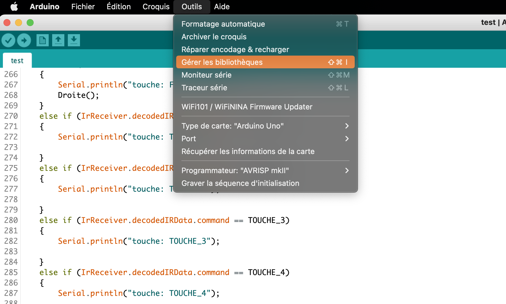
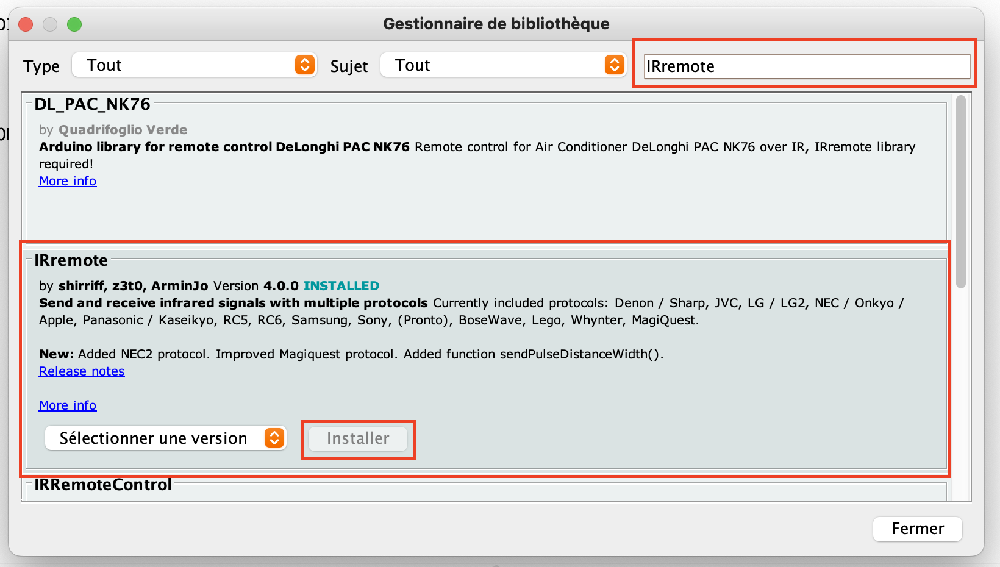
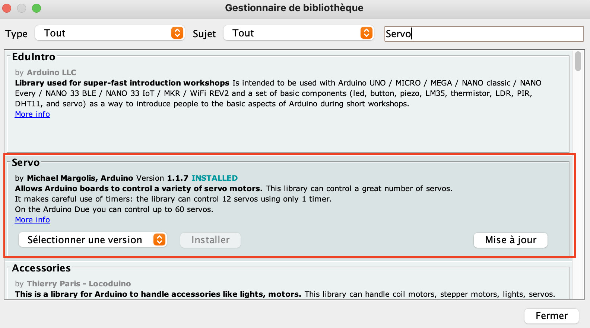
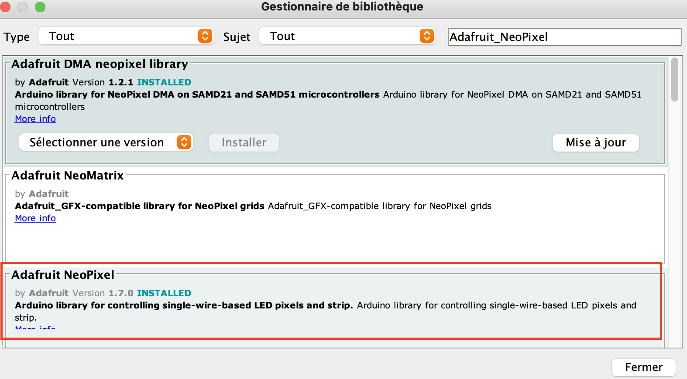

### WALL HIT
Robot téléguidé avec tir et cible laser

## Documentation
Quelques documents qui ont été utiles à la réalisaiton du projet sont dans le dossier "doc".
Ces liens peuvent être utiles aussi
https://arduino-france.site/capteur-luminosite/
https://arduino.blaisepascal.fr/controle-dun-servomoteur/#Cas_des_servomoteur_a_rotation_continue
https://www.electronique-mixte.fr/projet-pointeur-laser-avec-arduino/
https://arduino-france.site/adafruit-neopixel/

## Meca
Les plans des pieces mecaniques découpées au laser sont disponibles dans le dossier meca.

## compilation du programme
Le logiciel Arduino est téléchargeable ici:
https://www.arduino.cc/en/software
  

Pour ajouter les library necessaires au projet la procedure est:
- Cliquer sur "outils" puis "gérer les bibliothèques"

- Chercher les nom des library "IRremote" puis "Servo" et "Adafruit_NeoPixel" et les installer

Vous devriez maintenant pouvoir compiler le projet et le téléverser sur un Arduino